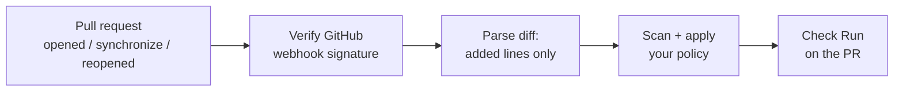

<div align="center">


# Warden CI

### The policy engine for AI-generated code.

**Block hallucinated packages, leaked secrets, and dangerous code at the pull request, under rules your team writes, reviews, and can audit.**


[**Try it live**](https://warden-ci-dvk5.onrender.com) · [Policy engine docs](POLICY_ENGINE.md) · [Setup](#get-started-in-5-minutes) · [Privacy](PRIVACY.md)

</div>

---

## Scanners tell you. Warden enforces.

Anyone can write a script that checks whether an npm package exists. What teams need when AI tools write a growing share of their code is **enforcement they can roll out safely, defend in an audit, and trust during an incident**:

- **Safe rollout.** Policies default to **report mode**. You review real findings first, then opt into block mode.
- **Every exception has an owner and an expiry.** No anonymous, permanent "ignore" rules.
- **A tamper-evident audit trail.** Versioned, optionally signed policy revisions, and audit events that record who changed what, and when.
- **Deterministic verdicts.** Findings come from registry data and the diff itself. No model guessing whether your code is "probably fine".

That is Warden's policy engine, and it is what separates it from a plain "does this package exist" check.

## The policy engine

Policies use **schema v1** and are edited in a built-in dashboard editor, through a REST API, or from a reviewed `warden-policy.json` in your repo (start from [`warden-policy.example.json`](warden-policy.example.json)).

### Built for enterprise review

| Capability | What it gives you |
| --- | --- |
| **Versioned policy** | Every revision has a schema, a revision number, and an optional parent revision. Revisions are immutable: a change writes a new row and never edits history. |
| **Inheritance** | Repository policies can inherit organization defaults. Child revisions are explicit and incremented. |
| **Signed revisions** | Deployments can require HMAC-signed policy envelopes (`WARDEN_POLICY_SIGNING_SECRET`), so an unsigned change can't slip through. |
| **Scoped suppressions** | Every suppression requires an **owner**, a **reason**, a **fingerprint or category scope**, and an **expiration**. |
| **Audit evidence** | Policy events record the actor, action, revision, mode, timestamp, and a policy digest. |
| **Standard exports** | SARIF 2.1.0 for GitHub code scanning, and CycloneDX 1.5-compatible vulnerability BOM data. |

### Roll out without breaking anyone's build

New repositories start in **report** mode. You opt into **block** mode once you've reviewed findings and set up protected-branch enforcement.

1. Start with `mode: report` and `failOnIncomplete: false`.
2. Review the report and suppression ownership weekly.
3. Add short-lived suppressions only, with an issue or ticket reference in the reason.
4. Sign policy revisions in CI before switching to `mode: block`.
5. Turn on protected-branch required checks once the baseline is clean.

Before you flip anything, the **live preview** replays your proposed policy against the stored findings from your most recent scan and shows exactly how many findings it would block, suppress, or ignore, compared with your current policy.

### Policy editor

Open `/policy` from your dashboard to manage everything without touching JSON:

- Enforcement-mode toggle (report / block) and minimum-severity dropdown
- Block-category checkboxes: `secret`, `execution`, `dependency`
- Editable lists of ignored paths and ignored packages
- A suppressions table with required owner, reason, and expiry fields
- Live preview of the blocking delta, plus inline field-level validation errors on save

### Policy API

Routes authenticate with the dashboard GitHub session and authorize the caller against the installation they own.

| Route | Purpose |
| --- | --- |
| `GET /api/policy/installations` | List the installations you own |
| `GET /api/policy` | Effective policy, active version, Pro status, suppressions, revision summary |
| `PUT /api/policy` | Validate and save a new immutable revision, with an audit event (`policy.updated`) |
| `GET /api/policy/versions` | Full revision history for the audit trail |
| `POST /api/policy/preview` | Compare blocking / suppressed / ignored counts for the current vs proposed policy |
| `POST /api/policy/suppressions` | Create or update a suppression (owner, reason, fingerprint, expiry required) |
| `DELETE /api/policy/suppressions/:id` | Remove a suppression, with an audit event |

The same stored policy drives real scan verdicts in `/api/scan` and the CI gate.

### Safe by default

- **No surprise blocking.** Saving `mode: "block"` requires an active Pro plan, and any entitlement-check error is treated as "not Pro". At scan time, block mode is downgraded to report unless Pro is verified live, so a billing outage never fails your CI job.
- **No false victory.** Warden never assumes a pull request fixed a vulnerability. A finding is resolved only when a later scan confirms its fingerprint is gone.

Full reference: **[POLICY_ENGINE.md](POLICY_ENGINE.md)**

## What it catches

| Detection | Example |
| --- | --- |
| **Hallucinated packages** | An import for a package that has no entry on the npm or PyPI registry. This is a real supply-chain risk when AI tools invent plausible names and attackers register them. |
| **Typosquat suspects** | A package published in the last 45 days whose name is within edit distance 2 of a popular package. |
| **Hardcoded secrets** | Likely credentials committed in added lines. |
| **Dangerous execution** | `eval()`, `new Function()`, unguarded shell exec. |

Warden scans **only the lines a PR adds**. Pre-existing code is never flagged, so adopting it on a mature repo doesn't bury you in noise.

### Beyond "does it exist?"

| | Plain existence check | **Warden CI** |
| --- | :---: | :---: |
| Flags nonexistent packages | ✅ | ✅ |
| Flags recently published near-miss names | ❌ | ✅ |
| Popularity data refreshed daily (npm downloads API, pypistats.org) | ❌ | ✅ |
| Multi-ecosystem (npm + PyPI) | Varies | ✅ |
| Versioned, signable policy with owner-and-expiry suppressions | ❌ | ✅ |
| SARIF and CycloneDX export | ❌ | ✅ |
| Audit trail of every policy change | ❌ | ✅ |
| CI gate that fails on blocking findings | ❌ | ✅ |

> Popularity refreshes run in the background, never on the PR request path, and the last good snapshot is kept if a source goes down. Maintainer-change detection is npm-only, since PyPI's JSON API doesn't expose uploader identity.

## How it works



1. GitHub sends a `pull_request` webhook to `/api/github/webhooks`.
2. Warden verifies the HMAC signature, so only requests signed by GitHub are processed.
3. It scans the added lines with correct new-file line numbers.
4. Findings are evaluated against your policy and posted as a **Warden CI** Check Run.

## Plans

| | **Free** | **Pro** |
| --- | :---: | :---: |
| Public repository scanning | ✅ | ✅ |
| Private repository scanning | | ✅ |
| Blocking checks | | ✅ |

Pro is billed through Gumroad. See [`BILLING_SETUP.md`](BILLING_SETUP.md) if you're self-hosting.

## Get started in 5 minutes

### 1. Install

```bash
npm install
cp .env.example .env     # fill in values; comments explain each one
```

### 2. Create the GitHub App

1. Go to <https://github.com/settings/apps/new>. [`app.yml`](app.yml) is a reference for permissions and events.
2. Permissions: `checks: write`, `contents: read`, `pull requests: read`. Subscribe to the `pull_request` event.
3. Set the **Webhook URL** to `https://<your-domain>/api/github/webhooks`.
4. Put the webhook secret in `GITHUB_WEBHOOK_SECRET`, the full `.pem` private key in `GITHUB_PRIVATE_KEY`, and the App ID in `GITHUB_APP_ID`.
5. Install the app on a test repo and open a PR that imports a fake package. A **Warden CI** Check Run appears with findings.

### 3. Run locally

```bash
npm run dev
```

Forward webhooks to your machine with [smee.io](https://smee.io) or the GitHub CLI.

## Use it in CI and editors

```bash
export WARDEN_URL="https://<your-domain>"
export WARDEN_API_TOKEN="<token>"

pnpm warden-scan path/to/diff.patch   # exit code 1 = gate failed
```

A reference workflow is at [`.github/workflows/warden-scan.yml`](.github/workflows/warden-scan.yml). It fails closed on blocking findings and needs the `WARDEN_URL` and `WARDEN_API_TOKEN` repository secrets. The endpoint rejects unauthenticated requests and never sends your source to telemetry.

| Format | Use it for |
| --- | --- |
| `?format=sarif` | GitHub code-scanning-compatible results |
| `?format=cyclonedx` | Dependency inventory exchange |

## Security by design

- **Signed webhooks only.** HMAC verification on every delivery.
- **Least-privilege reports.** `/details?runId=...` is authorized only when GitHub confirms the viewer has pull access to the exact repository on that run. No broad organization scope is requested.
- **Fail-closed admin.** Telemetry settings are installation-wide, and GitHub's APIs can't prove installation-wide admin authority from a repo-level check, so Warden denies access rather than guessing.
- **Private by default.** Telemetry stores only ecosystem, package name, verdict, optional impersonated package, and timestamp. It never stores code, paths, repository names, identity, or installation IDs. It's on for public repos, off for private repos unless the installation opts in, and every installation can opt out. Raw events expire after 90 days, aggregates after 365. Details in [`PRIVACY.md`](PRIVACY.md).

## Deploy

A standard Node app for Node 18+:

```bash
npm run build && npm start
```

Configs for [Fly.io](fly.toml), [Vercel](vercel.json) and [Docker](Dockerfile) are included. Runbooks are in [`OPERATIONS.md`](OPERATIONS.md).

> **Free-tier note:** Render's free tier spins down after about 15 minutes idle (roughly 30 s cold start). Billing state survives restarts via Upstash Redis, but consider a paid instance if you take real payments.

<details>
<summary><strong>Upgrading an existing database: run ownership migration</strong></summary>

<br />

1. Deploy `migrations/0002_installation_scoped_reports.sql`.
2. Run `pnpm db:ownership:report` against production `DATABASE_URL`. It is read-only, fails closed, and verifies ownership only through `scan_run.repository_id → repository.id → installation.id`.
3. Continue only when it shows **zero unresolved runs and zero integrity errors**.
4. Run `pnpm db:ownership:apply` (transactional, safe to rerun).
5. Re-run the report, deploy, then test one authorized report request and one cross-installation denial.

Nothing is guessed or silently rewritten. Unresolved rows stay inaccessible until reviewed manually.

</details>

## Project structure

```
src/
├── server.ts                  Express server, landing page, billing, webhook route
├── github/                    webhookHandler · appAuth · verifySignature
├── scan/
│   ├── ecosystems/            One adapter per registry (npm.ts, pypi.ts)
│   ├── riskSignals.ts         hallucinated + typosquat-suspect detection
│   ├── secrets.ts             Hardcoded credential detection
│   ├── dangerousExec.ts       eval / new Function / shell exec
│   └── diff.ts                Unified diff → added lines with line numbers
├── telemetry/corpusLog.ts     Privacy-scoped flagged-package log
└── billing/store.ts           Pro status (Upstash Redis)
ide-extension/                 VS Code extension scaffold
migrations/                    Database migrations
```

Adding a registry (crates.io, RubyGems) means writing one adapter file against the shared interface in `src/scan/ecosystems/types.ts`. The detection logic doesn't change.

## Roadmap

- **IDE extension:** a VS Code scaffold exists (npm existence checks only) and isn't published yet.
- **`/fix` auto-remediation:** a deterministic engine prototype exists for `package.json` and `requirements.txt`. It ships once GitHub write authorization, branch/PR operations, persistence and verification are in place.
- **`issue_comment` commands:** not implemented.
- **More registries:** crates.io and RubyGems.
- **Team / Enterprise:** coming once organization controls and audit workflows are live.

## Docs

[`POLICY_ENGINE.md`](POLICY_ENGINE.md) · [`BILLING_SETUP.md`](BILLING_SETUP.md) · [`OPERATIONS.md`](OPERATIONS.md) · [`PRIVACY.md`](PRIVACY.md) · [`TERMS.md`](TERMS.md) · [`REFUND.md`](REFUND.md)

## Contributing

Issues and pull requests are welcome. Run `pre-commit install` before your first commit.

---

<div align="center">

**[Try Warden CI →](https://warden-ci-dvk5.onrender.com)**

</div>
