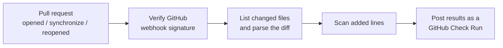

<div align="center">


# Warden CI

**Catch hallucinated packages, hardcoded secrets, and dangerous code in pull requests, before they merge.**

A GitHub App that scans every pull request for AI-generated code risks and reports the results as a native GitHub Check Run.


[Live site](https://warden-ci-dvk5.onrender.com) · [Policy engine](POLICY_ENGINE.md) · [Operations](OPERATIONS.md) · [Privacy](PRIVACY.md)

</div>

---

## Why Warden CI?

AI coding assistants are fast, and sometimes confidently wrong. They invent plausible-sounding package names that don't exist, paste in credentials, and reach for `eval()`. When a hallucinated package name gets registered by an attacker, that import becomes a **supply-chain attack waiting to happen**.

Warden CI puts a check at the pull request, where it's cheap to fix:

| It catches | Example |
| --- | --- |
| **Hallucinated packages** | An import for a package that has no entry on the npm or PyPI registry |
| **Typosquat suspects** | A package published within the last 45 days whose name is within edit distance 2 of a popular package |
| **Hardcoded secrets** | Likely credentials committed in added lines |
| **Dangerous execution** | `eval()`, `new Function()`, unguarded shell exec |

Everything runs **only on lines the PR adds**. Pre-existing code the PR didn't touch is never flagged.

## How it works



1. GitHub sends a `pull_request` webhook to `/api/github/webhooks`.
2. Warden verifies the HMAC signature, so only requests actually signed by GitHub are processed.
3. It authenticates as the GitHub App with an installation-scoped client and fetches the PR's changed files.
4. The scanners run against the added lines, with correct new-file line numbers.
5. Findings appear as a **Warden CI** Check Run on the PR.

### Package-risk signals

Warden goes beyond a plain "does this package exist" check:

- **`hallucinated`**: no registry entry exists for the package.
- **`typosquat-suspect`**: the package exists, was published within the last 45 days, **and** sits within edit distance 2 of a popular package name.
- Popularity rankings refresh daily in the background from npm's official downloads API and pypistats.org, are cached in Redis, and never run on the PR request path. If a source fails, the last good snapshot stays in memory.
- Maintainer-change detection is npm-only, because PyPI's JSON API doesn't expose uploader identity.

> **Note:** public metadata can't prove a private-name collision. Classic dependency confusion needs an organization's internal package list, so Warden uses only a narrow high-version / thin-history proxy for that case.

### Ecosystems

| Ecosystem | Status |
| --- | --- |
| npm | Live |
| PyPI | Live |
| crates.io, RubyGems | Not implemented. A new registry is one adapter file in `src/scan/ecosystems/` implementing the shared interface in `types.ts` |

## Plans

| | Free | Pro |
| --- | :---: | :---: |
| Public repository scanning | ✅ | ✅ |
| Private repository scanning | | ✅ |
| Blocking checks | | ✅ |

Pro is sold through Gumroad. Private-repo scanning is gated on Pro status. Team and Enterprise tiers are intentionally not offered until their organization controls and audit workflows exist.

## Getting started

### Prerequisites

- Node.js 18+
- A GitHub account that can create GitHub Apps
- An Upstash Redis instance (so Pro status persists across restarts)
- A Gumroad account, if you want to take payments (see [`BILLING_SETUP.md`](BILLING_SETUP.md))

### 1. Install

```bash
npm install
cp .env.example .env
```

Fill in `.env`. The comments in `.env.example` explain where each value comes from.

### 2. Create the GitHub App

1. Create an app at <https://github.com/settings/apps/new>. [`app.yml`](app.yml) is a reference for permissions and events.
2. Permissions: `checks: write`, `contents: read`, `pull requests: read`. Subscribe to the `pull_request` event.
3. Set the **Webhook URL** to `https://<your-domain>/api/github/webhooks`.
4. Generate a **webhook secret** and put it in `GITHUB_WEBHOOK_SECRET`.
5. Generate a **private key** (a `.pem` download) and paste its full contents into `GITHUB_PRIVATE_KEY`.
6. Copy the **App ID** into `GITHUB_APP_ID`.
7. Install the app on a test repo, then open a PR that imports a nonexistent package or contains a hardcoded-looking secret. A **Warden CI** Check Run should appear with findings.

### 3. Run locally

```bash
npm run dev
```

Use [smee.io](https://smee.io) or the GitHub CLI's webhook forwarding to route webhook deliveries to your machine.

## Using Warden in CI and editors

The same scanner is exposed through a token-protected API.

```bash
export WARDEN_URL="https://<your-domain>"
export WARDEN_API_TOKEN="<token>"

pnpm warden-scan path/to/diff.patch
```

Exit code `1` means the gate failed. The endpoint rejects unauthenticated requests and does not send source contents to telemetry.

A reference GitHub Action lives at [`.github/workflows/warden-scan.yml`](.github/workflows/warden-scan.yml). It fails closed when the API reports blocking findings and needs the `WARDEN_URL` and `WARDEN_API_TOKEN` repository secrets.

### Output formats

| Format | Use it for |
| --- | --- |
| `?format=sarif` | GitHub code-scanning-compatible results |
| `?format=cyclonedx` | Dependency inventory exchange |

## Policy

Copy [`warden-policy.example.json`](warden-policy.example.json) to `warden-policy.json` and review it like any other code change. Policy history and suppressions are persisted in Neon, so exceptions are attributable and can expire. See [`POLICY_ENGINE.md`](POLICY_ENGINE.md) for details.

## Security reports

`/details?runId=...` serves an authenticated, per-run security report. Access is granted only when GitHub's `GET /user/installations/{installation_id}/repositories` endpoint, called with the viewer's OAuth token, returns the exact repository stored on the run with `permissions.pull: true`. Read access is the intentional minimum, and no broad organization scope is requested.

Telemetry settings are installation-wide, and GitHub's repository-listing API can't prove installation-wide admin authority. Warden therefore **fails closed** for telemetry-settings access instead of letting every repository reader change them.

## Privacy and telemetry

Warden logs flagged-package events so detection improves over time. It stores **only**: ecosystem, package name, verdict, optional impersonated package, and timestamp. It **never** stores code, file paths, repository names, account identity, or installation IDs.

- **Public repositories:** enabled by default.
- **Private repositories:** excluded unless the installation explicitly opts in.
- **Retention:** raw events expire after 90 days, aggregate counts after 365 days.
- Every installation can opt out.

Full details are in [`PRIVACY.md`](PRIVACY.md).

## Deployment

It's a standard Node app, so it runs on Render, Fly.io, Railway, Vercel, or anywhere that runs Node 18+:

```bash
npm run build && npm start
```

Config for [Fly.io](fly.toml), [Vercel](vercel.json), and [Docker](Dockerfile) is included. See [`OPERATIONS.md`](OPERATIONS.md) for runbooks.

> **Free-tier hosting note:** Render's free tier spins down after about 15 minutes of inactivity, so the next request has a cold start of roughly 30 seconds. Billing state survives restarts (it lives in Upstash Redis), but if you're taking real payments, consider a paid instance.

<details>
<summary><strong>Upgrading an existing database: run ownership migration</strong></summary>

<br />

1. Deploy `migrations/0002_installation_scoped_reports.sql`.
2. Run `pnpm db:ownership:report` against the production `DATABASE_URL`. This is read-only and fails closed. It confirms ownership only through the chain `scan_run.repository_id → repository.id → installation.id`, never from names, current webhooks, or user input.
3. Don't continue until the report shows **zero unresolved runs and zero integrity errors**.
4. Run `pnpm db:ownership:apply`. It applies the two foreign keys transactionally and is safe to rerun.
5. Re-run the report, deploy the application, then test one authorized report request and one cross-installation denial.

No historical ownership is guessed or silently rewritten. Unresolved rows stay inaccessible to reports and need manual review against authoritative records.

</details>

## Project structure

```
src/
├── server.ts                  Express server: landing page, /subscribe, billing webhook, GitHub webhook route
├── github/
│   ├── webhookHandler.ts      pull_request events → scan → Check Run
│   ├── appAuth.ts             GitHub App auth, installation-scoped Octokit clients
│   └── verifySignature.ts     HMAC verification of incoming webhooks
├── scan/
│   ├── ecosystems/            One adapter per registry (npm.ts, pypi.ts)
│   ├── riskSignals.ts         hallucinated + typosquat-suspect detection
│   ├── popularPackages.ts     Popularity data for name-similarity checks
│   ├── secrets.ts             Hardcoded credential detection
│   ├── dangerousExec.ts       eval / new Function / shell exec detection
│   └── diff.ts                Unified-diff parser → added lines with line numbers
├── telemetry/corpusLog.ts     Privacy-scoped flagged-package event log
└── billing/store.ts           Pro status persistence (Upstash Redis)
ide-extension/                 VS Code extension scaffold (unfinished)
migrations/                    Database migrations
```

## Roadmap

Honest current status of what isn't done yet:

- **IDE extension:** a minimal VS Code scaffold exists (npm existence checks only, no typosquat or PyPI parity) and is not yet published.
- **`/fix` auto-remediation:** a side-effect-free deterministic engine prototype exists for npm `package.json` and Python `requirements.txt`. It stays unexposed until GitHub write authorization, branch/commit/PR operations, persistence, and verification are in place.
- **`issue_comment` handling:** not implemented.
- **More registries:** crates.io and RubyGems.
- **Team / Enterprise tiers:** pending organization controls and audit workflows.

## Documentation

| Doc | What's inside |
| --- | --- |
| [`BILLING_SETUP.md`](BILLING_SETUP.md) | Gumroad checkout, products, and webhook setup |
| [`POLICY_ENGINE.md`](POLICY_ENGINE.md) | Policy file format, suppressions, history |
| [`OPERATIONS.md`](OPERATIONS.md) | Running and maintaining a deployment |
| [`PRIVACY.md`](PRIVACY.md) | Telemetry fields, controls, retention |
| [`TERMS.md`](TERMS.md) · [`REFUND.md`](REFUND.md) | Terms of service and refund policy |

## Contributing

Issues and pull requests are welcome. A [pre-commit config](.pre-commit-config.yaml) is included, so run `pre-commit install` before your first commit.

---

<div align="center">

**[warden-ci-dvk5.onrender.com](https://warden-ci-dvk5.onrender.com)**

</div>
